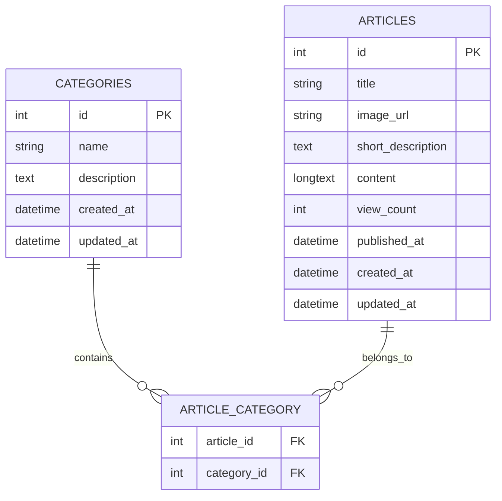

# Database Schema: Blog Engine MVP

> [!IMPORTANT]
> This schema is optimized for MySQL 8.0+ and following the repository's Database Policy.
> Charset: `utf8mb4` | Collation: `utf8mb4_unicode_ci` | Engine: `InnoDB`

## Mermaid Diagram



## SQL DDL

```sql
-- Categories Table
CREATE TABLE IF NOT EXISTS `categories` (
    `id` INT UNSIGNED AUTO_INCREMENT PRIMARY KEY,
    `name` VARCHAR(255) NOT NULL,
    `description` TEXT,
    `created_at` TIMESTAMP DEFAULT CURRENT_TIMESTAMP,
    `updated_at` TIMESTAMP DEFAULT CURRENT_TIMESTAMP ON UPDATE CURRENT_TIMESTAMP,
    INDEX `idx_category_name` (`name`)
) ENGINE=InnoDB DEFAULT CHARSET=utf8mb4 COLLATE=utf8mb4_unicode_ci;

-- Articles Table
CREATE TABLE IF NOT EXISTS `articles` (
    `id` INT UNSIGNED AUTO_INCREMENT PRIMARY KEY,
    `title` VARCHAR(255) NOT NULL,
    `image_url` VARCHAR(255),
    `short_description` TEXT NOT NULL,
    `content` LONGTEXT NOT NULL,
    `view_count` INT UNSIGNED DEFAULT 0,
    `published_at` DATETIME DEFAULT CURRENT_TIMESTAMP,
    `created_at` TIMESTAMP DEFAULT CURRENT_TIMESTAMP,
    `updated_at` TIMESTAMP DEFAULT CURRENT_TIMESTAMP ON UPDATE CURRENT_TIMESTAMP,
    INDEX `idx_published_at` (`published_at`),
    INDEX `idx_view_count` (`view_count`)
) ENGINE=InnoDB DEFAULT CHARSET=utf8mb4 COLLATE=utf8mb4_unicode_ci;

-- Article-Category Mapping (Many-to-Many)
CREATE TABLE IF NOT EXISTS `article_category` (
    `article_id` INT UNSIGNED NOT NULL,
    `category_id` INT UNSIGNED NOT NULL,
    PRIMARY KEY (`article_id`, `category_id`),
    CONSTRAINT `fk_article` FOREIGN KEY (`article_id`) REFERENCES `articles`(`id`) ON DELETE CASCADE,
    CONSTRAINT `fk_category` FOREIGN KEY (`category_id`) REFERENCES `categories`(`id`) ON DELETE CASCADE,
    INDEX `idx_category_id` (`category_id`)
) ENGINE=InnoDB DEFAULT CHARSET=utf8mb4 COLLATE=utf8mb4_unicode_ci;
```
